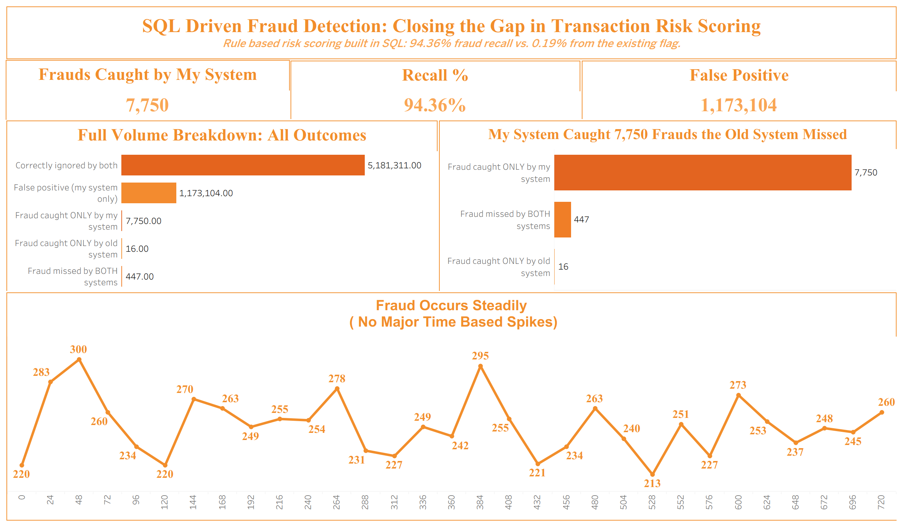

# SQL-Driven Fraud Detection: Closing the Gap in Transaction Risk Scoring

A rule-based fraud risk-scoring system built in MySQL (stored procedure, user-defined function and views) and visualized in Tableau. On 6.3 million synthetic payment transactions it raised fraud recall from **0.19%** (the existing flag) to **94.36%**.



## Business problem

A fictional digital payments company processes millions of transactions across five types: CASH_IN, CASH_OUT, DEBIT, PAYMENT and TRANSFER. Its existing fraud flag is a simple fixed rule and misses almost all fraud. The Risk and Fraud Analytics team needs to:

1. Build a stronger detection layer in SQL.
2. Measure how far the current flag falls short of real fraud.
3. Give the review team a dashboard they can act on.

## Dataset

[PaySim synthetic financial dataset](https://www.kaggle.com/datasets/ealaxi/paysim1) (Kaggle): 6,362,620 mobile-money transactions over a simulated 30 days. The data is synthetic, not from a real company.

Key columns: `step` (1 step = 1 hour), `type`, `amount`, sender and receiver account IDs, balances before and after, `isFraud` (the true label) and `isFlaggedFraud` (the existing baseline flag).

The CSV is too large for GitHub, so download it from Kaggle to reproduce the project.

## Pipeline

```
PaySim CSV -> staging table (LOAD DATA INFILE) -> normalized tables
           -> stored procedure + risk-score function -> views -> Tableau
```

## Database design

| Table | Purpose |
|---|---|
| `staging_transactions` | Raw copy of the CSV |
| `transaction_types` | Lookup table for the five transaction types |
| `accounts` | One row per account (customer `C` or merchant `M`) |
| `transaction` | Main table with foreign keys to accounts and types |
| `failed_transactions` | Log of rejected attempts from the stored procedure |

Foreign key checks were switched off during the bulk load and switched back on afterwards. The load ran in batches by `step` range to avoid client timeouts.

## SQL components

**Stored procedure: `process_transaction`.** Validates that the sender has enough balance, calculates the new balance, and inserts the transaction. If validation fails it rolls back and logs the attempt to `failed_transactions`. This shows how transaction validation and error handling work. It is separate from the fraud scoring and was tested with valid and invalid calls.

**Function: `calculated_risk_score`.** Returns a score using four rules. It never reads `is_fraud`, so there is no label leakage.

| Rule | Points |
|---|---|
| Type is TRANSFER or CASH_OUT | 30 |
| Sender balance drained to 0 with amount above 10,000 | 40 |
| Amount above 200,000 | 15 |
| Balance arithmetic does not add up | 10 |

A score of **70 or more** counts as high risk. The threshold requires a risky type and a drained balance together. This is the version that is live in the database and behind the dashboard.

**Views.**
- `fraud_detection_comparison` labels every transaction as caught or missed by each system.
- `high_risk_transactions` lists the transactions scoring 70 or more.

## Results

| Outcome | Transactions |
|---|---|
| Fraud caught only by my system | 7,750 |
| Fraud caught only by the old flag | 16 |
| Fraud missed by both | 447 |
| False positives (my system) | 1,173,104 |
| Correctly ignored by both | 5,181,311 |

Of the 8,213 real fraud cases, the old flag caught 16 (0.19% recall) and the SQL risk score caught 7,750 (94.36% recall).

## Trade-off and experiments

Precision is low, at about 0.66%: 1,173,104 legitimate transactions were flagged for review. Fraud and legitimate activity share the same surface patterns (TRANSFER or CASH_OUT with a drained balance), so a few rules cannot separate them cleanly.

I tested a stricter drain rule (amount above 50,000 instead of 10,000). It cut false positives by only about 7% but lost about 9 points of recall, so I kept the original threshold.

Fraud was also steady across the window, with 213 to 300 flagged cases per day and no major spikes.

### A fifth rule and a stricter threshold (tested, not adopted)

I added a fifth rule for TRANSFER transactions: a mismatch between the receiver's expected and actual new balance. On its own this rule was a strong signal — 99.98% of fraudulent transfers show a receiver-balance mismatch, against 29.85% of legitimate transfers. Added as a flat 25 points on top of the existing four rules at the same 70-point threshold, it made results worse, not better: false positives rose from 1,180,062 to 1,243,834 and recall fell slightly, because more *combinations* of rules could now reach 70, not fewer.

I then raised the threshold to 95, so a transaction only counts as flagged when the risky type, the drained balance, and the receiver mismatch all occur together. That produced a second, stricter model:

| Threshold | Frauds caught | Recall | False positives | Precision |
|---|---|---|---|---|
| **70 (4 rules) — live** | 7,750-8,012 | ~94-98% | ~1.18M | ~0.66% |
| 95 (5 rules) — tested | 3,804 | 46.3% | 609,949 | ~0.62% |

**Decision: kept the 70-point, 4-rule threshold as the live system.** Catching 97% of fraud at the cost of a large review queue is the right trade-off here, because missing fraud is a worse outcome than a reviewer dismissing a false alarm -- a bank would rather have a large but mostly-clean review queue than let three times more real fraud through. A large flagged volume is also a workload problem, not an accuracy problem: it is better solved by adding review capacity (automation, tiered prioritization, or more reviewers) than by a stricter rule that lets more fraud through. For the same reason, closing the precision gap further is better suited to an ML model trained and maintained by a dedicated data science or ML engineering team than to additional hand-written SQL rules, since an ML model can learn the subtler patterns that separate fraud from legitimate activity without discarding real fraud cases outright. The 95-point version is kept in this repository (`sql/04b_risk_score_function_v2.sql`, `sql/05b_views_v2.sql`) as a documented, tested alternative, not as the active system.

## Limitations

- The data is synthetic.
- The rules were designed with knowledge of PaySim's fraud patterns and evaluated on the same data, so there is no train and test split. Recall would likely be lower on unseen data.
- Real systems use richer signals that this dataset does not contain.

## Future improvements

- ML-based scoring, maintained by an ML/data science team, to improve precision without sacrificing recall
- Behavioral features such as transaction velocity, device and location
- Tiered risk bands (critical, high, review) built on the 70/95 scores so reviewers can prioritize the highest-confidence cases first
- Cross-chart interactivity in the dashboard

## How to reproduce

1. Download the PaySim CSV from Kaggle.
2. Run the scripts in `sql/` in order: `01_schema.sql` through `05_views.sql`. This builds the live, 70-threshold system.
3. Optionally run `04b_risk_score_function_v2.sql` and `05b_views_v2.sql` to reproduce the 95-threshold experiment (this replaces the function and views from step 2).
4. Open the Tableau workbook (or connect Tableau to the two views).

## Tools

MySQL 8, MySQL Workbench, Tableau Desktop
